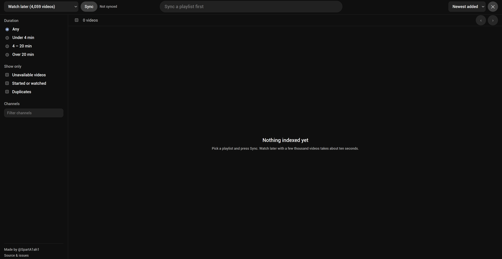
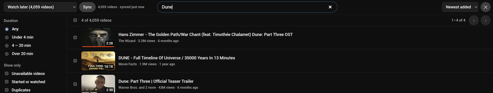

# Playlist Desk

A Chrome extension that turns any YouTube playlist — including **Watch Later**, which
the official API refuses to expose — into a searchable, filterable, bulk-editable list.

A few thousand videos in Watch Later means YouTube makes you scroll to the bottom before
you can search, and delete them one click at a time. Playlist Desk indexes the whole
playlist in a few seconds, then searches it instantly and edits it in batches.



## Features

- **Full index in seconds** — reads the playlist through YouTube's own internal API
  (the one the site itself uses), 100 videos per request, streamed into the list while
  it loads. No scrolling, no page rendering.
- **Instant search and filters** — title/channel search, duration buckets, per-channel
  counts, unavailable (deleted/private) videos, started-or-watched, duplicates.
- **Bulk actions** — select with click, shift-click, or select-all-filtered; remove,
  move or copy to another playlist, export CSV, open in tabs.
- **10-second undo** on removals; nothing is sent to YouTube until the window closes.
- **Correct "date added" order** — reads the playlist's own sort setting rather than
  guessing, so newest-first and oldest-first playlists both sort right.
- **Local only** — your data stays in the browser (IndexedDB). No server, no API key,
  no third-party account.
- Keyboard-first: `/` search, `Ctrl+A` select all, `Delete` remove, `←`/`→` pages, `Esc` close, `Alt+P` open.



## Install

**From a release zip**

1. Download `playlist-desk.zip` from the latest release and unzip it.
2. Open `chrome://extensions`, enable **Developer mode**, click **Load unpacked**, pick the folder.
3. Open youtube.com while signed in. Click **Playlists** in the top bar (or press **Alt+P**).

**From source**

```sh
npm install
npm run build      # type-checks, then bundles to dist/
```

Load `dist/` as an unpacked extension. `npm run dev` rebuilds on change.

## How it works

Three pieces, one browser, zero servers:

| Piece | Runs where | Job |
| --- | --- | --- |
| `content/bridge.ts` | YouTube page, **main world** | Calls InnerTube (`browse`, `browse/edit_playlist`) with the user's session; answers requests from the panel |
| `content/inject.ts` | YouTube page, isolated world | Adds the Playlists button, mounts the panel iframe, forwards close/navigate |
| `panel/` | extension page in an iframe | UI, local index in IndexedDB, filtering, batching, undo |

See [ARCHITECTURE.md](ARCHITECTURE.md) for the message protocol, the auth scheme, and
why the parser walks JSON by renderer key instead of hard-coding paths.

## Known limits

- InnerTube is undocumented. YouTube changes response shapes a few times a year; when
  that happens `parseVideo` / `listPlaylists` in `bridge.ts` are the places to patch.
- YouTube caps every playlist at 5,000 videos.
- "Date added" is inferred from position. A manually reordered playlist loses that mapping.
- "Watched" depends on the progress bar YouTube returns, which requires watch history to be on.

## Stack

TypeScript (strict), Vite, Manifest V3, IndexedDB. No framework, no runtime dependencies.

## Privacy

Nothing leaves the browser. See [PRIVACY.md](PRIVACY.md).

## Author

[@SpartA1ah1](https://x.com/SpartA1ah1)

## License

MIT
